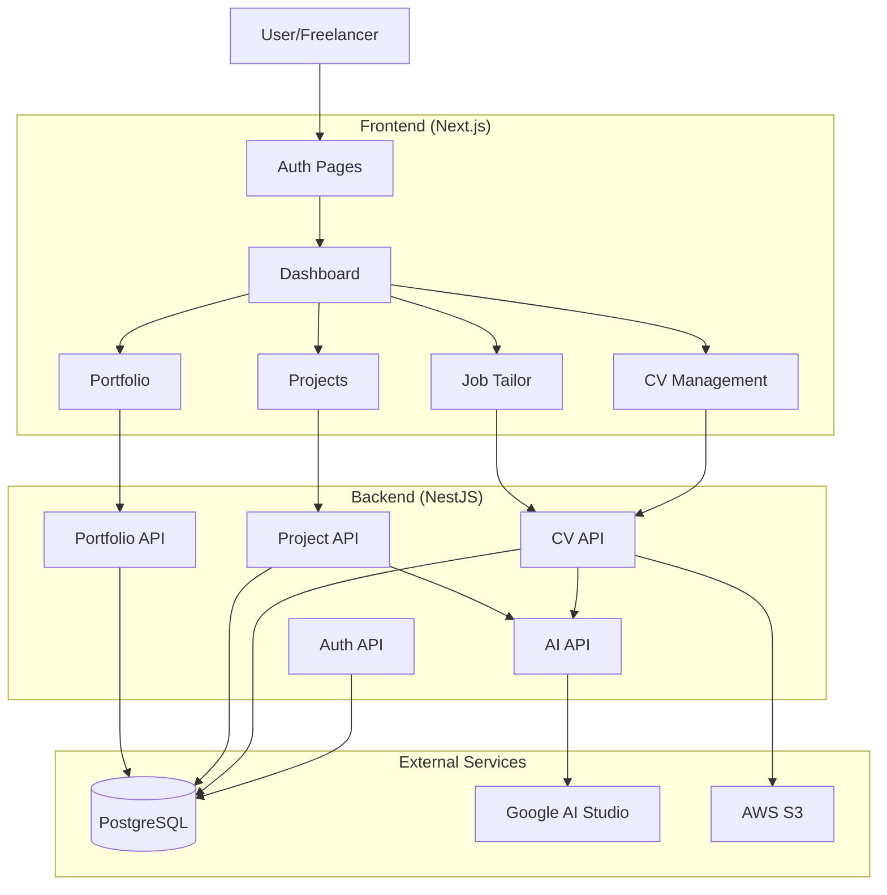
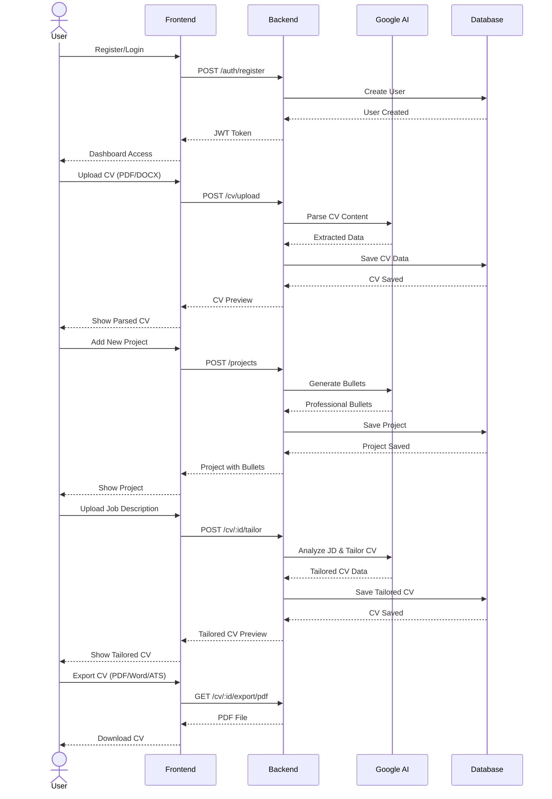
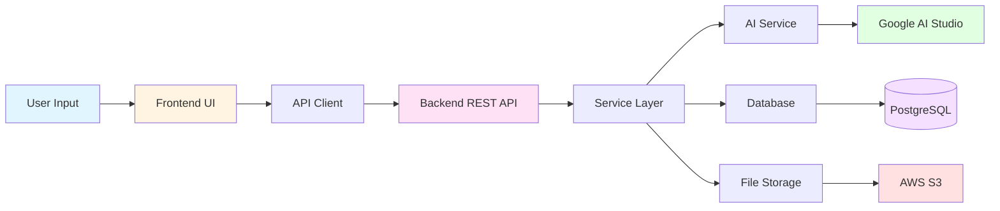
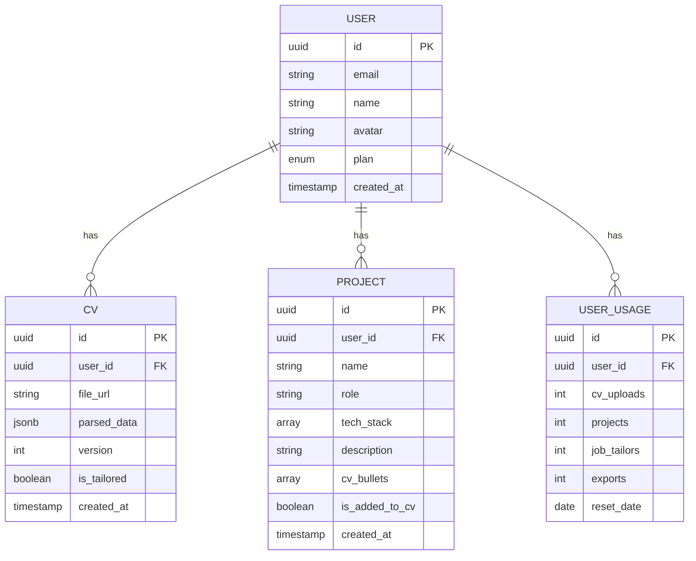

# Resumate

> **Update your CV in 1 minute** ⚡

An application that helps freelancers and professionals automatically update their **CV & Portfolio** from new projects or Job Descriptions (JD). Reduce manual editing time, increase professionalism, and update profiles to match employer language.

---

## 📋 Overview

Resumate is an automated CV and Portfolio management platform that helps users:
- Upload and analyze CV with AI
- Automatically create tailored CVs based on Job Descriptions
- Manage projects with AI-generated bullet points
- Create beautiful online portfolios
- Export CVs to multiple formats (PDF, Word, ATS-friendly)

---

## ✨ Core Features

### 1. 📄 Import & Manage CV
- Upload CV (PDF/DOCX)
- AI analyzes and extracts: education, experience, skills, projects
- Store as JSON for easy updates

### 2. 💼 Update CV from New Projects
- Input project info (name, role, tech stack, results)
- AI automatically creates professional bullet points
- Automatically add to CV

### 3. 🎯 Update CV from Job Description
- Upload/paste JD
- AI analyzes keywords and requirements
- Create tailored CV matching the job
- Highlight relevant experience

### 4. 🌐 Portfolio Generation
- Auto-generate portfolio from CV data
- 3 templates: Basic, Modern, Creative
- Shareable portfolio link
- Responsive design

### 5. 📥 Multi-format Export
- Export CV: PDF, Word, ATS-friendly text
- Export portfolio: HTML download
- Shareable links

### 6. 💡 Smart Suggestions
- AI-powered CV improvement suggestions
- Keyword optimization
- ATS compatibility tips
- Experience enhancement

---

## 📊 System Architecture & Flow

### System Flow Diagram



### User Journey Flow



### Data Flow Architecture



---

## 🛠 Tech Stack

### Frontend
- **Framework**: Next.js 15 with TypeScript
- **Styling**: Tailwind CSS
- **Animation**: Framer Motion
- **State Management**: React Query (@tanstack/react-query)
- **Form Handling**: React Hook Form + Zod validation
- **Icons**: Lucide React
- **File Upload**: React Dropzone

### Backend
- **Framework**: NestJS with TypeScript
- **Database**: PostgreSQL (AWS RDS)
- **ORM**: TypeORM
- **Authentication**: JWT + Passport
- **File Processing**: Multer, pdf-parse, mammoth
- **Export**: Puppeteer, html-pdf-node, docx
- **AI**: Google AI Studio (Gemini 1.5 Flash)

### Infrastructure
- **Database**: AWS RDS PostgreSQL
- **File Storage**: AWS S3 (planned)
- **Hosting**: Docker + Kubernetes (planned)
- **CI/CD**: GitHub Actions (planned)

---

## 🚀 Getting Started

### Prerequisites
- Node.js 18+
- npm/yarn
- PostgreSQL database
- Google AI Studio API key

### Installation

#### 1. Clone repository
```bash
git clone <repository-url>
cd resumate
```

#### 2. Backend Setup
```bash
cd backend
npm install

# Copy and configure environment variables
cp env.example .env

# Update .env with your credentials:
# - Database credentials (PostgreSQL)
# - Google AI API key
# - JWT secret
# - Port configuration
```

**Backend .env configuration:**
```env
# Database
DB_HOST=your-database-host
DB_PORT=5432
DB_USERNAME=postgres
DB_PASSWORD=your-password
DB_NAME=postgres

# Google AI Studio
GOOGLE_AI_API_KEY=your_google_ai_api_key
GOOGLE_AI_MODEL=gemini-1.5-flash

# JWT
JWT_SECRET=your_jwt_secret
JWT_EXPIRES_IN=7d

# App
PORT=3003
NODE_ENV=development
```

#### 3. Frontend Setup
```bash
cd frontend
npm install

# Frontend will automatically connect to backend on port 3003
```

#### 4. Run Application

**Terminal 1 - Backend:**
```bash
cd backend
npm run start:dev
```

**Terminal 2 - Frontend:**
```bash
cd frontend
npm run dev
```

**Access:**
- Frontend: http://localhost:3002
- Backend API: http://localhost:3003
- API Health Check: http://localhost:3003/ai/health

---

## 📁 Project Structure

```
resumate/
├── backend/                    # NestJS Backend
│   ├── src/
│   │   ├── modules/
│   │   │   ├── auth/          # Authentication module
│   │   │   ├── users/         # User management
│   │   │   ├── cv/            # CV management
│   │   │   ├── projects/      # Project management
│   │   │   ├── portfolio/     # Portfolio generation
│   │   │   └── ai/            # AI services
│   │   ├── common/            # Guards, decorators, filters
│   │   ├── shared/            # Shared services
│   │   └── main.ts
│   └── package.json
│
├── frontend/                   # Next.js Frontend
│   ├── src/
│   │   ├── app/               # App routes
│   │   │   ├── auth/          # Auth pages
│   │   │   └── dashboard/     # Dashboard pages
│   │   ├── components/        # React components
│   │   ├── contexts/          # React contexts
│   │   └── lib/               # API clients, utilities
│   └── package.json
│
└── requiments/                 # Requirements documents
    ├── idea.md
    ├── wireframe.md
    ├── tech.md
    └── todo.md
```

---

## 🔌 API Endpoints

### Authentication
- `POST /auth/register` - Register new user
- `POST /auth/login` - User login
- `POST /auth/google` - Google OAuth
- `GET /auth/profile` - Get user profile

### CV Management
- `POST /cv/upload` - Upload CV
- `GET /cv` - Get all CVs
- `GET /cv/:id` - Get CV by ID
- `PUT /cv/:id` - Update CV
- `POST /cv/:id/tailor` - Tailor CV for JD
- `GET /cv/:id/suggestions` - Get improvement suggestions
- `GET /cv/:id/export/pdf` - Export as PDF
- `GET /cv/:id/export/word` - Export as Word
- `GET /cv/:id/export/ats` - Export ATS format

### Project Management
- `POST /projects` - Create new project
- `GET /projects` - Get all projects
- `GET /projects/:id` - Get project by ID
- `PUT /projects/:id` - Update project
- `DELETE /projects/:id` - Delete project
- `POST /projects/:id/add-to-cv` - Add project to CV
- `POST /projects/:id/regenerate-bullets` - Regenerate bullet points

### Portfolio
- `POST /portfolio/generate` - Generate portfolio
- `POST /portfolio/html` - Generate HTML portfolio
- `POST /portfolio/url` - Generate portfolio URL
- `GET /portfolio/:username` - View public portfolio

### AI Services
- `POST /ai/parse-cv` - Parse CV text
- `POST /ai/generate-bullets` - Generate bullet points
- `POST /ai/tailor-cv` - Tailor CV content
- `POST /ai/suggestions` - Generate suggestions
- `POST /ai/extract-keywords` - Extract keywords from JD
- `GET /ai/health` - Health check

---

## 💻 Development

### Backend Development
```bash
cd backend

# Run in development mode
npm run start:dev

# Build for production
npm run build

# Run tests
npm run test

# Run e2e tests
npm run test:e2e
```

### Frontend Development
```bash
cd frontend

# Run development server
npm run dev

# Build for production
npm run build

# Start production server
npm start

# Run linter
npm run lint
```

---

## 🎨 Features Showcase

### User Flow
1. **Register** → Upload CV → AI analyzes & saves
2. **Add project** → AI suggests bullet points → Update CV
3. **Apply for job** → Upload JD → Create tailored CV → Export
4. **Showcase** → Create Portfolio link → Share

### AI-Powered Features
- **CV Parsing**: Automatically extract information from CV
- **Bullet Generation**: Create professional bullet points
- **Job Matching**: Tailored CV based on job requirements
- **Smart Suggestions**: Improvement suggestions based on best practices
- **Keyword Optimization**: ATS-friendly content

### Export Options
- **PDF**: Professional design templates
- **Word**: Editable format
- **ATS**: Plain text format optimized for ATS systems
- **HTML**: Portfolio download

---

## 🔐 Security & Performance

### Security
- JWT authentication với refresh tokens
- Password hashing với bcrypt
- Rate limiting theo user plan
- File validation và size limits
- CORS configuration
- SQL injection protection (TypeORM)

### Performance
- React Query caching
- Database connection pooling
- AI retry logic với exponential backoff
- Fallback parsing khi AI fails
- Lazy loading components

---

## 📦 Business Model

### Freemium Tiers

**Free Plan:**
- Upload 1 CV
- Maximum 3 projects/month
- 5 job tailoring requests/month
- 10 exports/month
- Basic portfolio template

**Pro Plan:**
- Unlimited CV uploads
- Unlimited projects
- Unlimited job tailoring
- Unlimited exports
- All portfolio templates
- Custom domain for portfolio
- Priority AI processing

---

## 🗺 Roadmap

### Phase 1: Foundation ✅
- [x] Backend setup (NestJS)
- [x] Frontend setup (Next.js)
- [x] Database integration
- [x] Authentication system
- [x] AI integration (Google AI Studio)

### Phase 2: Core Features ✅
- [x] CV upload & parsing
- [x] Project management
- [x] Job tailoring
- [x] Portfolio generation
- [x] Export functionality

### Phase 3: Advanced Features 🚧
- [ ] Real-time collaboration
- [ ] Analytics dashboard
- [ ] LinkedIn integration
- [ ] GitHub integration
- [ ] Mobile app
- [ ] Multi-language support

### Phase 4: Launch & Scale 📋
- [ ] Testing suite
- [ ] Docker containerization
- [ ] CI/CD pipeline
- [ ] Performance optimization
- [ ] Production deployment

---

## 🧪 Testing

### Test Google AI Integration
```bash
cd backend
GOOGLE_AI_API_KEY=your_key node test-ai.js
```

### API Testing với curl
```bash
# Health check
curl http://localhost:3003/ai/health

# Register user
curl -X POST http://localhost:3003/auth/register \
  -H "Content-Type: application/json" \
  -d '{"email":"user@example.com","name":"User Name","password":"password123"}'

# Login
curl -X POST http://localhost:3003/auth/login \
  -H "Content-Type: application/json" \
  -d '{"email":"user@example.com","password":"password123"}'
```

---

## 📝 Environment Variables

### Backend (.env)
```env
# Database
DB_HOST=your-database-host
DB_PORT=5432
DB_USERNAME=postgres
DB_PASSWORD=your-password
DB_NAME=postgres

# Google AI Studio
GOOGLE_AI_API_KEY=your_google_ai_key
GOOGLE_AI_MODEL=gemini-1.5-flash

# JWT
JWT_SECRET=your_jwt_secret
JWT_EXPIRES_IN=7d

# Google OAuth (optional)
GOOGLE_CLIENT_ID=your_client_id
GOOGLE_CLIENT_SECRET=your_client_secret

# AWS S3 (planned)
AWS_ACCESS_KEY_ID=your_aws_key
AWS_SECRET_ACCESS_KEY=your_aws_secret
AWS_REGION=us-east-1
AWS_S3_BUCKET=resumate-files

# App
PORT=3003
NODE_ENV=development
```

### Frontend
Frontend tự động kết nối với backend API. Không cần cấu hình thêm.

---

## 🤝 Contributing

1. Fork the repository
2. Create your feature branch (`git checkout -b feature/AmazingFeature`)
3. Commit your changes (`git commit -m 'Add some AmazingFeature'`)
4. Push to the branch (`git push origin feature/AmazingFeature`)
5. Open a Pull Request

---

## 📄 License

This project is licensed under the MIT License.

---

## 👥 Target Users

- **Freelancers**: Update CV after each project
- **Job Seekers**: Tailor CV for each job application
- **Consultants**: Showcase professional portfolio
- **Developers/Designers**: Manage technical portfolio

---

## 🌟 Key Differentiators

### vs LinkedIn Premium
- ✅ Automates CV creation & updates
- ✅ Tailored CV for each specific JD
- ✅ Portfolio hosting for freelancers
- ✅ Diverse export formats

### vs Traditional CV Tools
- ✅ AI-powered content generation
- ✅ Automatic project bullet points
- ✅ Job-specific optimization
- ✅ ATS-friendly formatting

---

## 📊 Current Status

- **Backend**: 95% complete ✅
- **Frontend**: 100% complete ✅
- **AI Integration**: 100% complete (Google AI Studio) ✅
- **Database**: Connected to PostgreSQL RDS ✅
- **Overall**: 95% complete

### Remaining Tasks
- AWS S3 file upload setup
- Unit & integration tests
- Docker containerization
- Production deployment

---

## 🔗 Links

- **Frontend**: http://localhost:3002
- **Backend API**: http://localhost:3003
- **API Documentation**: http://localhost:3003/api (Swagger - planned)

---

## 📞 Support

For issues and questions, please open an issue on GitHub.

---

---

## 📈 Database Schema



---

**Made with ❤️ for Freelancers and Job Seekers**
